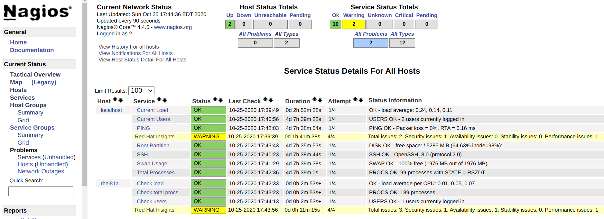

# What is check_insights?
It's a small python tool (``check_python.py``) which allows you to do some simple integration to Red Hat Insights locally in a shell on your Red Hat Enterprise Linux 8 server.

## Contributing
Please send me pull request if you can improve this tool. Design priciple is: keep it simple. Atm. there are no plans to turn the tool into a Red Hat Insight swish army knife.

# Prerequisite
Install Red Hat Insights and register, see: https://access.redhat.com/products/red-hat-insights#getstarted

## Installation
* Download the check_insights.py script
```
$ wget https://raw.githubusercontent.com/mglantz/check_insights/main/check_insights.py -O check_insights.py
```
* Put the script on the servers you want to monitor.

## Normal mode
Running ``check_insights.py`` without arguments uses the normal mode, which simply displays numbers of identified issues found in Red Hat Insights.

## Monitoring mode
Running ``check_insights.py`` with ``--mon true`` enters the tool into monitoring mode. It allows for a simple integration from Red Hat Insights to you monitoring tool of choice. Below, example integration with Nagios is shown.



In monitoring mode the tool looks at:

* Total number of issues for your system
* Number of security related issues
* Number of performance related issues
* Number of stability related issues
* Number of availability related issues

You can then also for each of above things set custom thresholds for warning and critical, if warning or critical levels are reached, the tool exists with a non-zero exit code to indicate OK, wanring or critical. You can customize exit codes if you like. 

The tools integrates out-of-the-box with popular open source monitoring solution Nagios as it uses the default exit codes to indicate warning (1) and critical (2) and unknown (3) in Nagios.

If we breach critical level for one of the items above, we exit indicating critical state, also if other items are OK.

## Usage and view default values
1) Download check_insights.py.
2) Make executable and run
```
# chmod 755 ./check_insights.py
# ./check_insights.py --help
```

# Example use-cases
Here's a list of example use-cases.

## Check if Red Hat Insights is reporting issues for your system.
./check_insights.py

Example:
```
# ./check_insights.py
Total issues: 2. Security issues: 1. Availability issues: 0. Stability issues: 0. Performance issues: 1
#
```

## Run in monitoring mode, using default values only.
./check_insights.py --mon true

Example:
```
# python3 check_insights.py --mon true
Total issues: 2. Security issues: 1. Availability issues: 0. Stability issues: 0. Performance issues: 1
# echo $?
1
#
```

## Run in monitoring mode, using custom values.
./check_insights.py --mon true --ctot 10 --wtot 7 --csec 1 --wsec 1 --cavail 3 --wavail 2 --cstab 3 --cstab 2 --cperf 3 --wperf 2 

Example:
```
# python3 ./check_insights.py --mon true --ctot 11 --wtot 7 --csec 1 --wsec 1 --cavail 3 --wavail 2 --cstab 3 --cstab 2 --cperf 3 --wperf 2 
Total issues: 2. Security issues: 1. Availability issues: 0. Stability issues: 0. Performance issues: 1
# echo $?
2
#
```

## Run in monitoring mode, supressing alerts for all but one item
./check_insights.py --mon true --ctot 99999 --wtot 99999 --csec 1 --wsec 1 --cavail 99999 --wavail 99999 --cstab 99999 --cstab 99999 --cperf 99999 --wperf 99999 

Example:
```
# python3 ./check_insights.py --mon true --ctot 99999 --wtot 99999 --csec 1 --wsec 1 --cavail 99999 --wavail 99999 --cstab 99999 --cstab 99999 --cperf 99999 --wperf 99999 
Total issues: 2. Security issues: 1. Availability issues: 0. Stability issues: 0. Performance issues: 1
# echo $?
2
#
```

## Example Nagios command definition
```
define command {
    command_name    check_insights
    command_line    /usr/bin/sudo /usr/bin/python3 $USER1$/check_insights.py --mon true
}
```

## Example Nagios service definition
```
define service {
    use                 local-service
    host_name           localhost
    service_description Red Hat Insights
    check_command       check_insights
}
```
